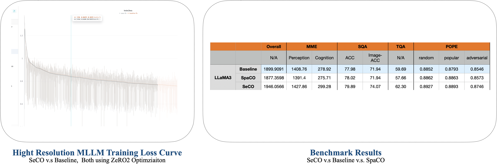
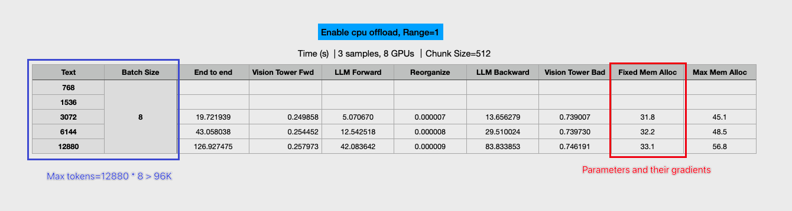
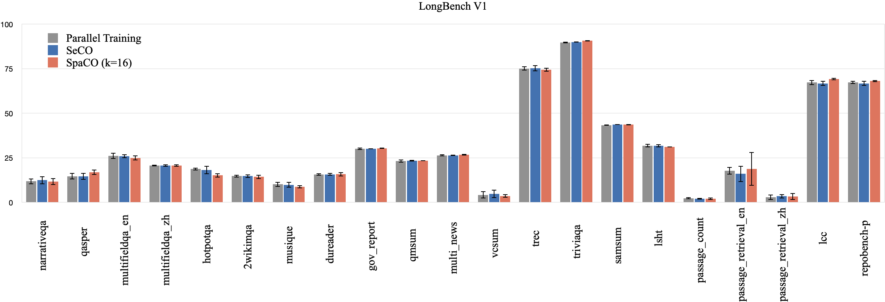
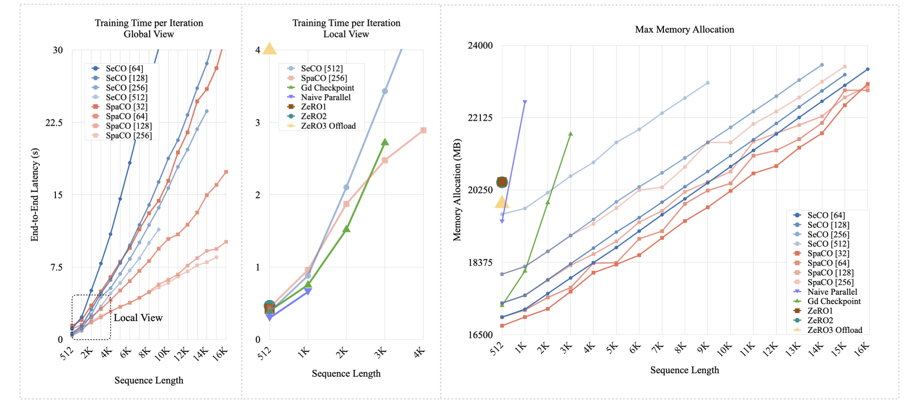

[Download Paper](https://github.com/wenhaoli-xmu/seco/raw/main/320.pdf)

## Multi-Model Instruction Tuning (based on LLaVA-HR)

This training is running on 8 * A100 GPUs, using Deepspeed zero2 optimization. The base model is LLaMA3-8B and we full finetune its parameters on the official instruct tuning dataset of LLaVA-HR.




We used our new implementation, which supports kv cache offloading, to run this experiments. The core codes are listed as follows:

## 🤖Inst-Tuning Results

To more comprehensively validate the performance of SeCO and SpaCO, we further compared them with model parallel (running on 4 RTX 3090 GPUs, utilizing gradient checkpointing) in the instruction fine-tuning task. The results are shown in the figure below:



## 👁️Overview

We propose SeCO and SpaCO for training LLMs under memory-constrained scenarios.

### Sequential Chunk-wise Optimization (SeCO)

* Employs a step-by-step strategy to execute forward propagation and localized backward propagation in chunks, with only one computational graph stored in GPU memory at any given time.

* Enables exact gradient computation, achieving gradient accuracy up to **12 decimal places** when using fp64 precision.

* Maintains near-native training speed when the chunk size is efficiently large, with no significant slowdown compared to conventional gradient checkpointing.

### Sparse Chunk-wise Optimization (SpaCO)

* Extends SeCO by introducing sparsification during backward propagation.

* Gradually aligns training costs with inference costs as context length increases.

* While unable to compute exact gradients, the resulting trade-offs remain practically acceptable for most applications.

Compared to mainstream training approaches, SeCO and SpaCO demonstrate substantial efficiency advantages:




## 🚀Quick Start


### Installation

```bash

$ git clone https://github.com/wenhaoli-xmu/seco.git
$ cd seco
$ pip install -e .
$ pip install -r requirements.txt
```

### Example-1: Single GPU

```python
from chunkoptim.utils import chunkize, SecoCache


chunk_size = 128


for batch in data_loader:
    
    input_ids = list(chunkize(batch.input_ids, -1, chunk_size))
    labels = list(chunkize(batch.labels, -1, chunk_size))
    kv_cache = SecoCache(model.num_layers)

    # forward prop
    with torch.no_grad():
        for chunk_input, chunk_target in zip(input_ids, labels):
            inputs = dict(
                input_ids=chunk_input,
                labels=chunk_target,
                kv_cache=kv_cache)
            model(**inputs)

    accum_loss = 0

    gen = reversed(list(enumerate(zip(input_ids, labels))))

    for i, (chunk_input, chunk_target) in gen:

        tmp_kv_cache = kv_cache.range(i)

        # graph reconstruction
        inputs = dict(
            input_ids=chunk_input,
            labels=chunk_target,
            kv_cache=tmp_kv_cache)

        loss = model(**inputs).sum() / batch['seq_len']
        accum_loss += loss.item()


        # localized backward prop
        tmp_kv_cache.index(i).copy_scaled_grad(gd=kv_cache.index(i).grad)
        loss.backward()

    optim.step()
    optim.zero_grad()
```

### Example-2: Multiple GPUs (Deepspeed)

⚠️If you use Deepspeed for distributed training, the gradient won't synchronize until the model_engine.step() function call, which meets the requirements of SeCO. Otherwise, you should cancel gradient synchronization manually to prevent redundant communication.

```python
from chunkoptim.utils import chunkize, SecoCache
chunk_size = 128

for batch in data_loader:
    input_ids = list(chunkize(batch.input_ids, -1, chunk_size))
    labels = list(chunkize(batch.labels, -1, chunk_size))
    kv_cache = SecoCache(model.num_layers)

    # forward prop
    with torch.no_grad():
        for chunk_input, chunk_target in zip(input_ids, labels):
            inputs = dict(
                input_ids=chunk_input,
                labels=chunk_target,
                kv_cache=kv_cache)
            model_engine(**inputs)

    accum_loss = 0

    gen = reversed(list(enumerate(zip(input_ids, labels))))

    for i, (chunk_input, chunk_target) in gen:

        tmp_kv_cache = kv_cache.range(i)

        # graph reconstruction
        inputs = dict(
            input_ids=chunk_input,
            labels=chunk_target,
            kv_cache=tmp_kv_cache)

        loss = model_engine(**inputs).sum() / batch['seq_len']
        accum_loss += loss.item()

        # localized backward prop
        tmp_kv_cache.index(i).copy_scaled_grad(gd=kv_cache.index(i).grad)
        model_engine.backward(loss)

    model_engine.step()
```

