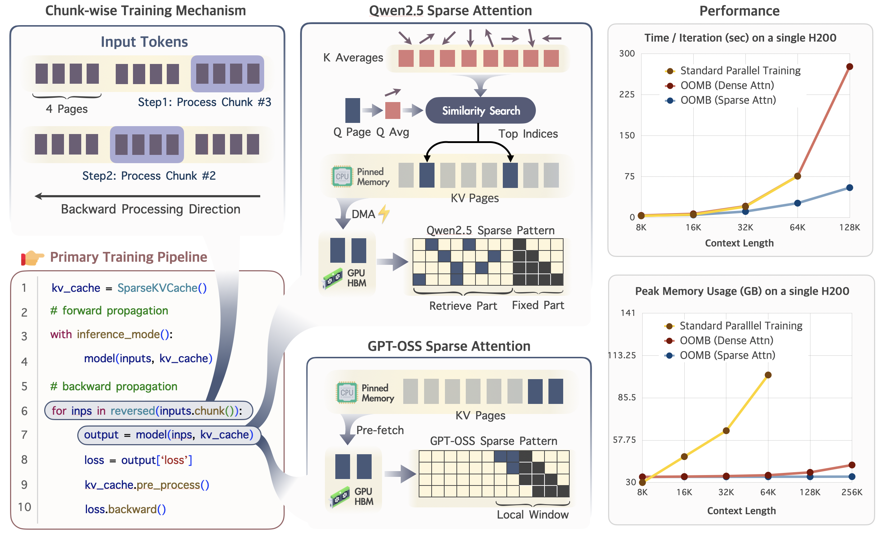

# OOMB: Out Of the Memory Barrier 

## What is OOMB❓

**OOMB** is a highly memory-efficient training system designed to overcome the prohibitive GPU memory barriers in training Large Language Models (LLMs) with million-token contexts.



## Core Features 🎯

* 🧠 **O(1) Activation Memory**: Employs a chunk-wise training framework with on-the-fly activation recomputation. This keeps the memory footprint for activations constant, regardless of the sequence length.

* ⚡️ **Efficient KV Cache Management**: Integrates a suite of synergistic optimizations to manage the growing KV cache:

    * **Paged Memory Management**: A paged memory system for both the KV cache and its gradients to eliminate memory fragmentation and reallocation overhead.
    
    * **Asynchronous CPU Offloading**: Pre-fetches and offloads the KV cache and gradients to CPU memory, effectively hiding data transfer latency behind computation.
    
    * **Page-Level Sparse Attention**: Reduces computational complexity and minimizes data transfer, working in concert with the paged kv cache management.
    
* 📈 **Unprecedented Scalability**: The synergy of these techniques yields exceptional efficiency.  
    * Train a 4M-token context Qwen2.5-7B model on a single H200 GPU.
    * Memory overhead increases by a mere 10MB for every additional 10K tokens of context.


# Installation

Install dependencies with a single command:

```bash
pip install -r requirements.txt
```

Or install them manually:

```bash
torch
pygments
accelerate==1.10.1
transformers==4.45.0
datasets==2.18.0
tokenizers==0.20.3
triton==3.1.0
```

# Test Efficiency

1. Navigate to the `test_efficiency` directory and configure the relevant JSON files.

    * `test_efficiency/config_baseline.json` for configuring parallel training.
    * `test_efficiency/config_blockwise.json` for configuring chunk-wise training + dense attention.
    * `test_efficiency/config_blockwise_sparse.json` for configuring chunk-wise training + sparse attention.

    Refer to the parameter descriptions below for setup:

    | **Param** | **Illustration** |
    | --- | --- |
    | **grad_ckpt** | Layer-wise checkpointing. Recomputes activations during the backward pass to save memory. |
    | **block_size** | The chunk size for chunk-wise training. Default is 4096. | 
    | **page_size** | Default is 128 for H200. Must be set to 64 for A100. | 
    | **cpu_offload** | Choose between `null` (disabled) and `2` (enabled). | 
    | **page_budget** | The number of pages to retrieve for sparse attention. Default is 64. |

2. Run the efficiency test script.

    You can set the number of GPUs for tensor parallelism (minimum 1), modify the config file to switch training pipelines, and adjust the context length for testing.

    ```bash
    MASTER_ADDR=localhost
    MASTER_PORT=$((RANDOM % 101 + 20000))

    torchrun \
        --rdzv-backend=c10d \
        --rdzv-endpoint=${MASTER_ADDR}:${MASTER_PORT} \
        --nnodes 1 \
        --nproc_per_node 4 \ # 4x Tensor parallelism
        test_efficiency/test.py \
        --context "[32768, 65536, 131072, 262144, 524288, 1048576]" \
        --config test_efficiency/config_blockwise_sparse.json
    ```

# Test Gradient Estimation Accuracy

1. Modify the configuration files.

    This test evaluates the gradient estimation error of chunk-wise training with sparse attention compared to standard parallel training.

    This section also includes three config files corresponding to parallel training, chunk-wise training + dense attention, and chunk-wise training + sparse attention. Refer to the "Test Efficiency" section for parameter details.

2. Run `test.sh`.

    * Before running, modify the `ROOT_DIR` path to specify where the `.pth` files will be saved.
    * For single-GPU setups, set `--nproc_per_node` to `1` to disable tensor parallelism. This will not affect the final results.
    * Standard parallel training may encounter OOM errors for sequences longer than 64K tokens. For longer sequences, it is recommended to use block-wise training with dense attention as the baseline.

    ```bash
    bash test_accuracy/test.sh
    ```

3. Compare the gradients calculated by different pipelines.

    ```bash
    python test_accuracy/compare.py \
        --baseline /path/to/blockwise-tp.pth \
        --ours /path/to/blockwise-tp-sparse-256.pth \
        --root-dir /path/to/root_dir
    ```


